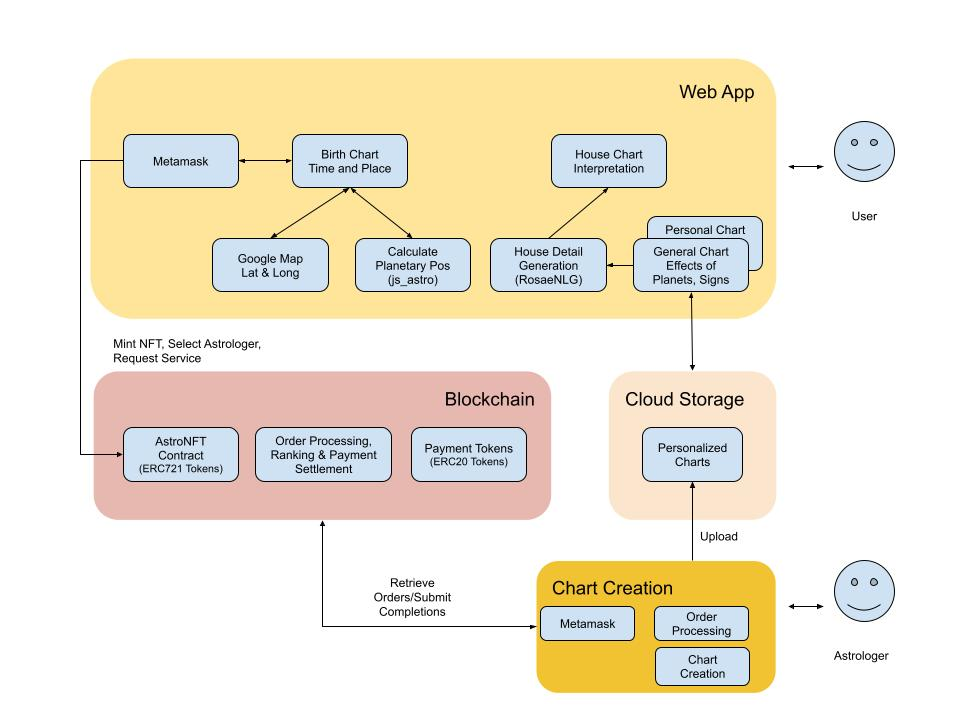

# AstroNft

## Overview


## Purpose of Application
* Generate Birth Chart that gives a visual presentation of ascending Zodiac sign and planetary positions in the sky as they appear in the sky at the time of birth. When you stand facing east direction (with right hand pointing to south), you will be seeing your ascendant sign rising in the East at the time of your birth.
 
* Interactive display of Houses also known as Bhavas or fields of action, where different areas of life are highlighted. Textual description of the Houses are shown in a side panel. The content will originate from a service provider that the user has a subscription to. If the user does not have subscription with a service provider, he can view auto generated content using an AI system for fun.
 
* The application can create/mint an NFT(Non Fungible Token) on a Blockchain. We refer to this token as AstroNFT in the remaining part of this document. AstroNFT provides a unique ID that will be used to manage user subscriptions. AstroNFT token holders are users as well as owners of the platform. AstroNFT is transferable.

* This web application interacts with AstroNFT Platform to (1) display the content obtained from a service provider and (2) authorize payment dues that will be settled on the Blockchain. AstroNFT platform helps a service provider to reach a wider audience and users with a choice to select a provider.

## Service Provider Protocol for House or Bhava Details
The service provider can generate the data either to display and view interactively in the application or in a form that can be viewed outside the application.
### Introduction
Both Vedic and Western astrology systems use the House system to group the attributes and analyze.
The birth chart includes 12 houses starting from the ascending sign. There are several systems to construct the houses such as placidus, whole-sign, equal house system etc,. Equal house system is the simplest and we will use the system in this application. 

Each house covers certain attributes of an individual. Some simplistic approaches cover the Zodiac sign of Sun and/or Zodiac sign of the Moon as the Zodiac sign of the individual to predict the tendencies that result into either 12 categories(Sun or Moon) or 144(Sun and Moon) categories. The House or Bhava system is more complex as it considers placement of all the planets in the 12 signs as well as ascending sign at the time of birth. This creates billions of different charts(12x12**9 i.e. 12 houses and 12 signs that can be occupied by 9 planets with various combinations).
 
The application displays the following parameters used in Vedic House System. The information provided by the service provider can be corresponding to these elements.  
#### Attributes related to a house
  House | Attributes
  ------| ----------  
  House1| Intellect, Health, Appearance, Beauty, Character, Purpose of Life, Behaviour, 
  House2| Health, Family, Comforts, Early Education, Speech, Movable Assets   
  House3| Younger Siblings, Communication, Intelligence, Fine Arts, Short Journeys  
  House4| Mother, Emotion Education, Home, Property, Surrounding in Old Age, Vehicles 
  House5| Children, Recreation, Devotion, Speculation, Accumulated Karma  
  House6| Diseases, Maternal Uncle/Aunt, Litigation, Mental Worries 
  House7| Spouse, Business Partner, Death, Respect Passion 
  House8| Longevity, Obstacles, Suffering, Attractiveness, Inheritance, Accidents  
  House9| Father, Luck, Higher Learning, Philosophy, Guru, Prosperity, Travel, Deeds of Virtue 
  House10| Profession, Status and Fame, Power, Father, Mother-in-law 
  House11| Friends, Hopes, Earnings, Social Activities, Elder Siblings 
  House12| Expenses, Sleep, Spirituality,  Pilgrimage, Liberation, Foreign residency 
  
#### Zodiac Signs

#### Planetary postitions 
The planets: Sun, Moon, Mars, Mercury, Venus, Jupiter, Saturn, Rahu and Ketu
<p>Planetary Aspects</p>  

Aspect| Attributes
------|-----------
Conjuction|  -TO DO-
Opposition|
Square|
Trine|

Planet Relationships  

Planet| Friend|Enemy
------|-------|-----
Sun|   -TO DO-| -TO DO-
Moon|
Mars|
Mercury|
Venus|
Jupiter|
Saturn|
Rahu|
Ketu|

Planetary Exaltations and Debilations
Planet| Exaltation| Debilation | Moola Trikona | House
------|-----------|------------|---------------|---
Sun| -TO DO-
Moon|
Mars|
Mercury|
Venus|
Jupiter|
Saturn|
Rahu|
Ketu|
#### Divisional charts 
Chart| Attributes
-----|-------
D1| -TO DO-
D3|
D4| 
D7|
D9| 
D10| 
D12|
D20| 
D27| 
D30| 
D40| 
D45| 
D60|
  

### Protocol for communication with Service Provider
The API call to service provider includes an  API request that indicates the planetary positions either using Zodiac signs or offset in degrees from start of  Aries as following:


Example Queries:
Query Based on planetary positions spefified using Zodiac signs
```
https://api.astronft.org/analyse/?house=1&asc=aries&sun=leo&moon=cancer&mars=aries&venus=taurus&mercury=gemini&saturn=aquarius&jupiter=sagittarius&rahu=aries&ketu=libra
```

Query Based on planetary positions spefified in degrees from start of Aries. Three decimal digits for each planet from right to left in the order ascendant, sun, moon, mercury, venus, mars, jupiter, saturn, rahu & ketu
```
https://api.astronft.org/analyse/house=1&planets=000030060090120150160180250290
```

The service returns the details of the house requested.

### Protocol for communication with Blockchain
-- TODO--